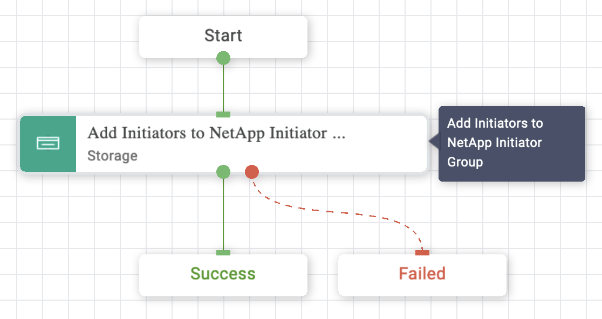

# Add Initiators to NetApp Initiator Group Workflow

## Workflow description and tasks

The Add Initiators to NetApp Initiator Group workflow adds one or more
initiators to an existing initiator group.

## Workflow inputs
\* indicates the input is required

- **Storage Device\***

- **Storage Virtual Machine\***

- **Initiator Group\***

- **Initiators:** The initiators to add to the initiator group. Use Fibre
Channel (FC) world wide port names (WWPNs), iSCSI qualified names
(IQNs), and/or iSCSI extended unique identifiers (EUIs) to identify host
initiators.

## Example workflow execution

1.  Select the storage device, storage virtual machine, and initiator
    group.

2.  Provide the initiator(s) to add to the initiator group.

3.  Review your input selections for correctness, then click **Execute**.

4.  View workflow execution details on the History tab.

**NOTE:** There is no Rollback available for this workflow. If you need to
undo this workflow execution, please use the Remove Initiators from
NetApp Initiator Group workflow.