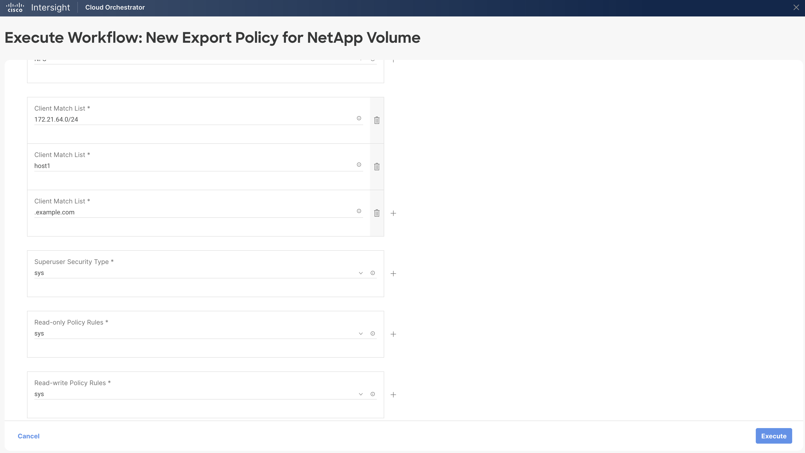

# New Export Policy for NetApp Volume Workflow

## Workflow description and tasks

The New Export Policy for NetApp Volume workflows creates a new export
policy and then adds the export policy to the specified volume.

## Workflow inputs
\* indicates the input is required

**Storage Device\***

**Storage Virtual Machine\***

**Volume\***

**Export Policy Name\*:** Name of the new export policy. An export
policy rule will be added using the inputs listed below.

**Export Policy Protocols\*:** Protocol(s) for which you want to apply
the export policy rule. Default is NFS.

**Client Match List\*:** Match string(s) specifying the client or
clients to grant access to in the export policy rule.

**SuperUser Security Type\*:** Security type(s) for superuser access to
files. Default is sys.

**Read-only Policy Rules\*:** Security type(s) for read-only access to
volumes that use the export rule. Default is sys.

**Read-write Policy Rules\*:** Security type(s) for read-write access to
volumes that use the export rule. Default is sys.

## Example workflow execution

1.  Select the storage device, storage virtual machine, and volume to
    which the new export policy will be added.

2.  Provide the export policy name to use for the new export policy. Add
    the protocol(s) and client match string(s) for the export policy
    rule.

3.  Add the security type(s) to use for superuser access, read-only
    access, and read-write access in the export policy rule.

4.  Review your input selections for correctness, then click **Execute**.

5.  View workflow execution details on the History tab.

