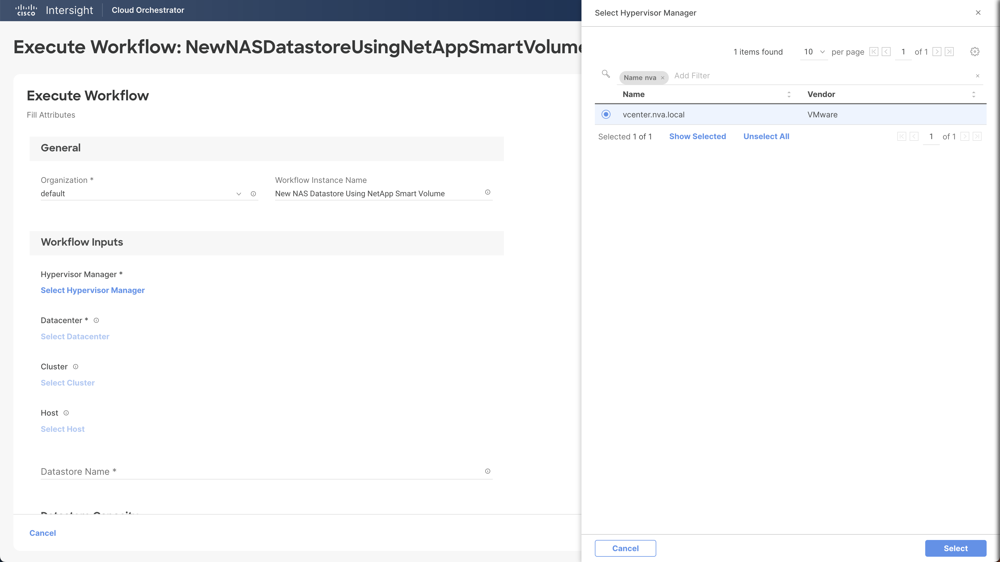

# New NAS Datastore Using NetApp Smart Volume Workflow

## Workflow description and tasks

The New NAS Datastore Using NetApp Smart Volume workflow creates a
volume and a NAS datastore of the same name.

## Workflow inputs
\* indicates the input is required

### Hypervisor inputs:

**Hypervisor Manager\*:** Hypervisor manager managing the cluster in the
datacenter.

**Datacenter\*:** Datacenter associated with the cluster where the
datastore will be hosted.

**Cluster:** Cluster on which the datastore will be hosted.

**Host:** Host on which the datastore will be hosted. If the cluster is
specified, the host parameter will be ignored.

**Datastore Name\*:** Name of the datastore (which will also be the
volume name)

**Datastore Capacity\*:** Size of the datastore

**Datastore Type\*:** Type of the datastore (NFS version 3 or 4.1)

**Security Type\*:** Security for the NFS datastore. Kerberos support is
enabled in NFS 4.1 only. Default is the basic AUTH_SYS security.

**Access Mode\*:** Access mode for the NFS server

### Storage inputs:

**Storage Device\***

**Storage Virtual Machine\***

**Distribute volume data across cluster:** Select this checkbox to
provision a FlexGroup volume.

**Performance Service Level\*:** Performance service levels represent
the performance expectations of the clients or applications using the
storage system. The selection of a performance service level indicates
the location of the new storage in the storage device and the QoS policy
assigned to the storage. Value is used for applications for which
throughput and capacity are more important than latency. Performance is
used for applications with modest performance needs and latency. Extreme
is used for applications that expect the lowest latency and highest
performance. **NOTE:** If the selected performance service level is not
valid for the storage platform, the task will fail with an error
message. Use the 'None' option if the storage virtual machine already
has a QoS policy group.

**Export Policy\*:** You can select an existing export policy or create
a new export policy. To create a new export policy, select the 'New
Export Policy' checkbox, and provide the client match. Client match is a
match string specifying the client or clients to grant access to in the
export policy rule. The new export policy uses NFS for access protocol
and sys for read-only access rule, read-write access rule, and superuser
security type.

**Enable Local Snapshot Copies:** Select this checkbox to enable local
snapshot copies using the default snapshot policy.

## Example workflow execution

1.  Select the hypervisor manager, datacenter, and cluster where the
    datastore will be created. Leave the host unselected to mount the
    new datastore on all the hosts. To mount the new datastore on a
    single host, select the host, but not the cluster.

2.  Provide the desired datastore name and capacity. Select the
    datastore type, access mode, and security type.

3.  Select the storage device and storage virtual machine.

4.  If you want to provision a FlexGroup volume, select 'Distribute
    volume data across cluster'. Otherwise, leave it unselected. Select
    the desired performance service level. **NOTE:** If the selected
    performance service level is not valid for the storage platform, the
    task will fail with an error message.

5.  Either select an existing export policy or create a new export
    policy. The example below selects an existing export policy named
    default. To create a new export policy instead, select 'New Export
    Policy', then provide the client match (e.g., 10.1.12.0/24).

6.  Leave 'Enable Local Snapshot Copies' selected to enable local
    snapshot copies using the default policy. Unselect 'Enable Local
    Snapshot Copies' if snapshot copies are not desired.

7.  Review your input selections for correctness, then click **Execute**.

8.  View workflow execution details on the History tab.

