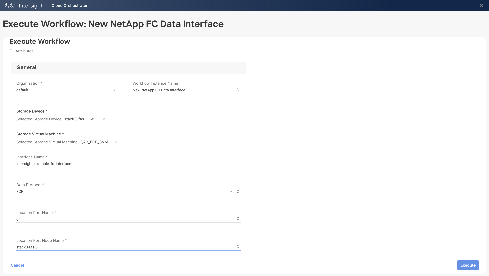

# New NetApp FC Data Interface Workflow

## Workflow description and tasks

The New NetApp FC Data Interface workflow creates a Fibre Channel data
interface using either Fibre Channel Protocol or NVMe over Fibre Channel
(NVMe/FC).

## Workflow inputs
\* indicates the input is required

**Storage Device\***

**Storage Virtual Machine\***

**Interface Name\*:** Name for the new FC data interface.

**Data Protocol\***: Data protocol that can be served by the interface.

**Location Port Name\*:** FC port on which to create the interface.

**Location Port Node Name\*:** Port node being used to create the
interface.

## Example workflow execution

1.  Select the storage device and storage virtual machine.

2.  Provide the name of the interface to create. Select the data
    protocol. Provide the name of the FC port and port node.

3.  Review your input selections for correctness, then click **Execute**.

4.  View workflow execution details on the History tab.

