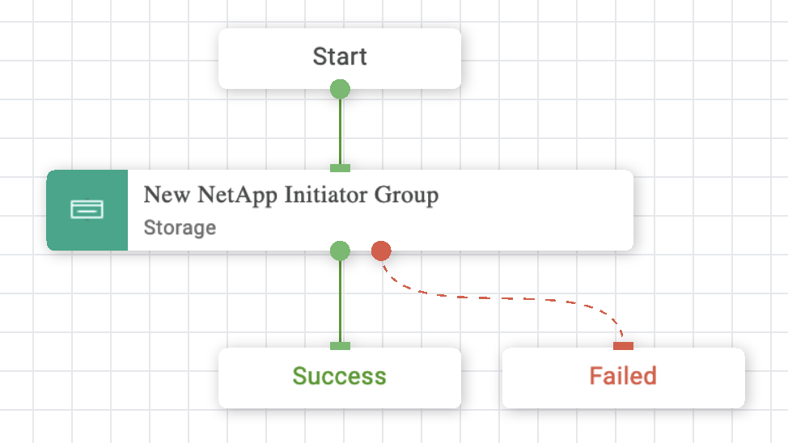
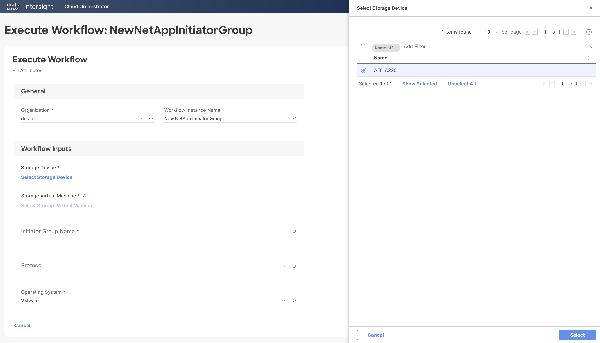
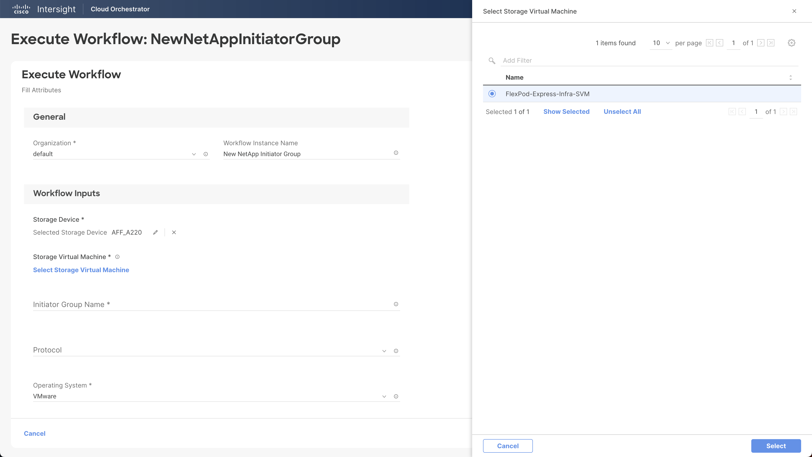
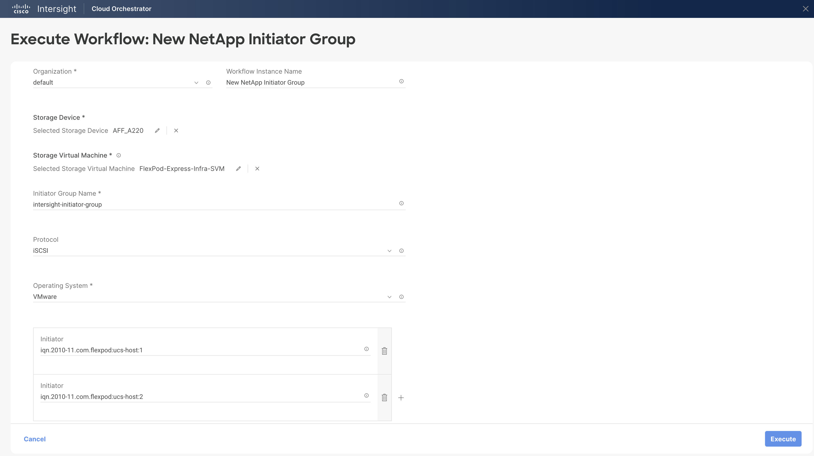
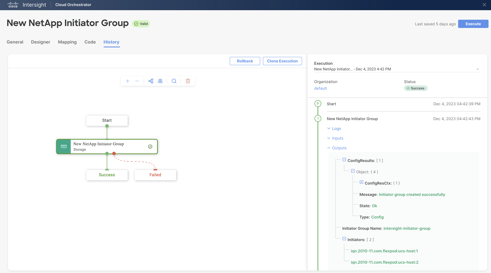

# New NetApp Initiator Group Workflow

## Workflow description and tasks

The New NetApp Initiator Group workflow creates a new initiator group.

## Workflow inputs
\* indicates the input is required

- **Storage Device\***

- **Storage Virtual Machine\***

- **Initiator Group Name\*:** The name of the initiator group.

- **Protocol:** The protocol(s) supported by the initiator group (iSCSI,
FCP, or Mixed).

- **Operating System\*:** The host operating system of the initiator
group. All initiators in the group should be hosts of the same operating
system. The default is VMware.

- **Initiators:** The initiator(s) to add to the new initiator group. Use
Fibre Channel (FC) world wide port names (WWPNs), iSCSI qualified names
(IQNs), and/or iSCSI extended unique identifiers (EUIs) to identify host
initiators.

## Example workflow execution

1.  Select the storage device and storage virtual machine.

2.  Provide the initiator group name, protocol, operating system, and
    the initiator(s) to add to the initiator group.

3.  Review your input selections for correctness, then click **Execute**.

4.  View workflow execution details on the History tab.

