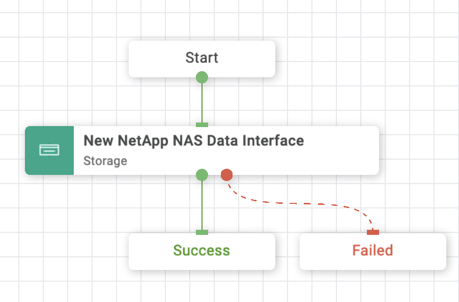
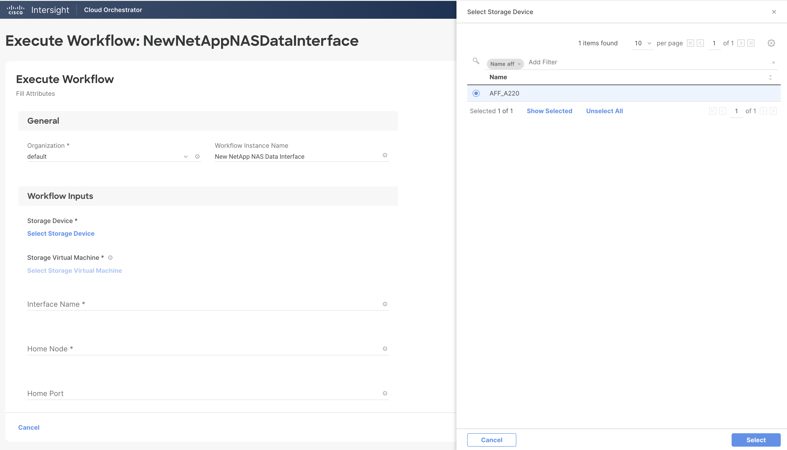
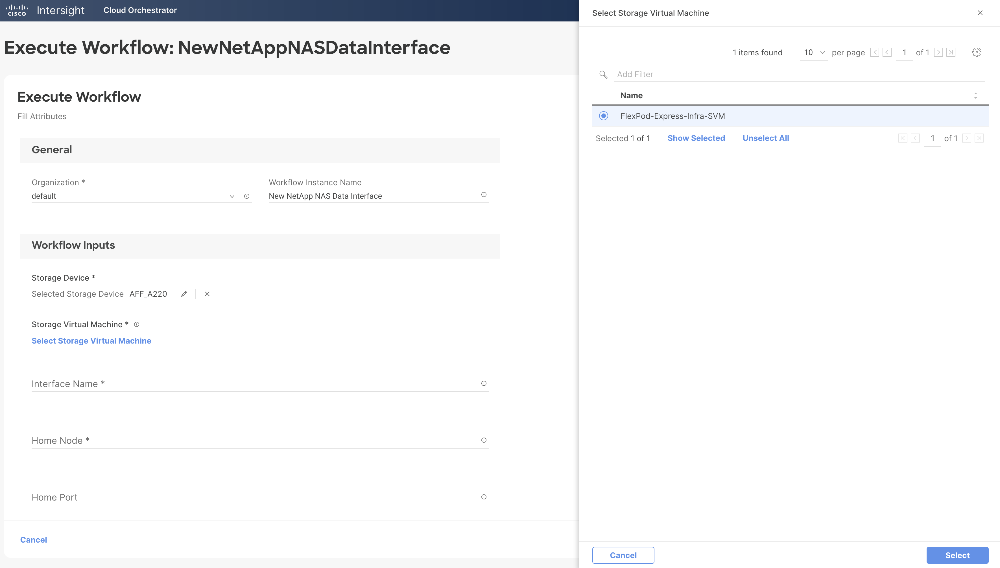
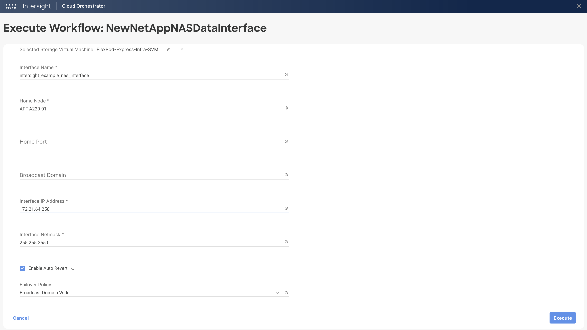
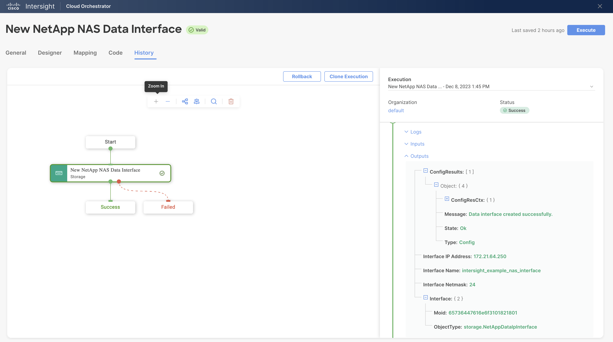

# New NetApp NAS Data Interface Workflow

## Workflow description and tasks

The New NetApp NAS Data Interface workflow creates a NAS data interface.

## Workflow inputs
\* indicates the input is required

**Storage Device\***

**Storage Virtual Machine\***

**Interface Name\*:** Name for the new NAS data interface.

**Home Node\*:** Home node is the node to which the interface returns
when the network interface revert command is run.

**Home Port:** Home port is the port to which the interface returns when
the network interface revert command is run.

**Broadcast Domain:** Broadcast domain contains the home port of the
logical interface.

**Interface IP Address\*:** IP address for the interface

**Interface Netmask\*:** Netmask for the interface

**Enable Auto Revert:** This specifies whether a data LIF is
automatically reverted to its home node under certain circumstances.
These circumstances include startup, when the status of the management
database changes to either master or secondary, or when the network
connection is made.

**Failover Policy:** Policy that defines where an interface is permitted
to move on failover. The policy options are: Disabled, System Defined,
Local Only, SFO Partner Only, and Broadcast Domain Wide. Broadcast
Domain Wide is the workflow default.

-   Disabled: failover is disabled for the interface.

-   System Defined: the system determines appropriate failover targets
    for the interface. The default behavior is that failover targets are
    chosen from the interface\'s current hosting node and also from one
    other non-partner node when possible.

-   Local Only: the interface fails over to a port on the local or home
    node of the interface.

-   SFO Partner Only - the interface fails over to a port on the home
    node or SFO partner only.

-   Broadcast Domain Wide: the interface fails over to a port in the
    same broadcast domain as the home port.

## Example workflow execution

1.  Select the storage device and storage virtual machine.

2.  Provide the name of the interface and home node. The home port and
    broadcast domain are optional. Provide the IP address and netmask to
    use for the interface. Update the auto revert and failover policy
    selections if you do not want the defaults.

3.  Review your input selections for correctness, then click **Execute**.

4.  View workflow execution details on the History tab.

