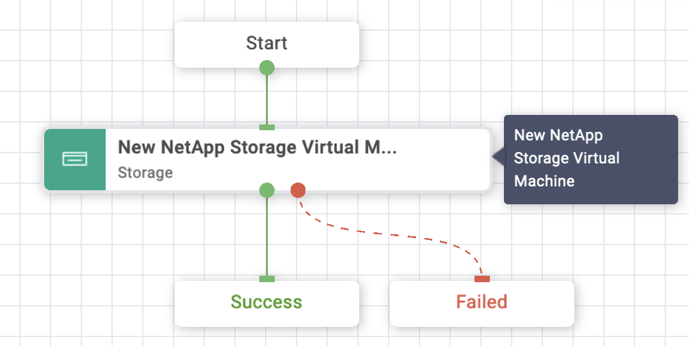
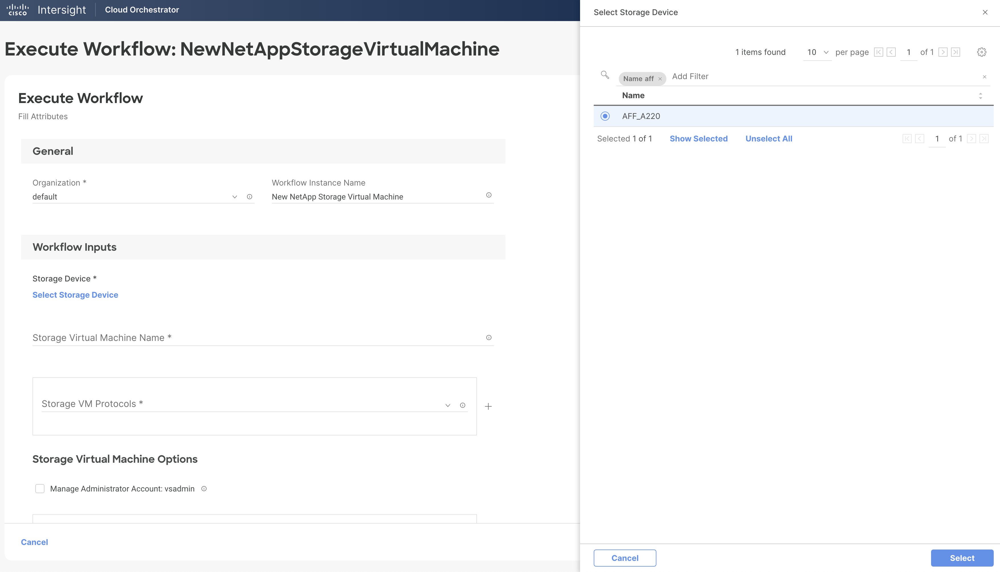
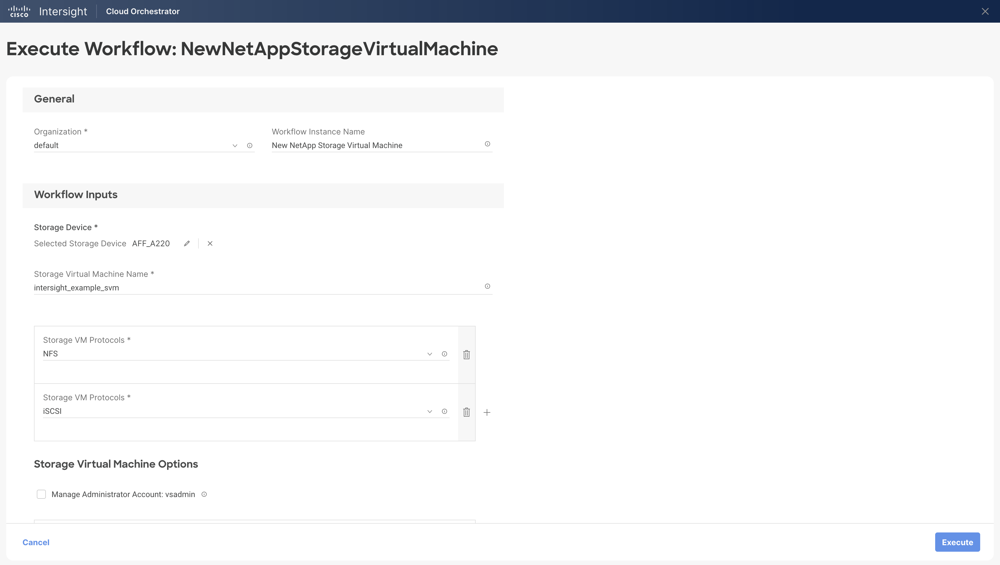
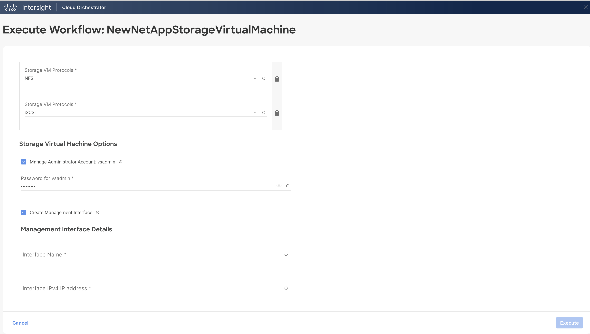
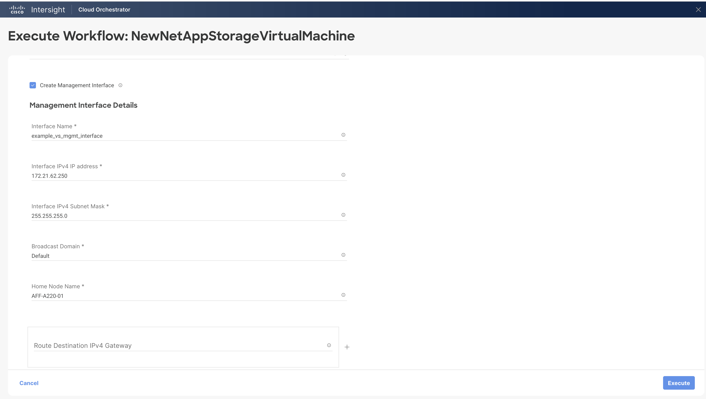
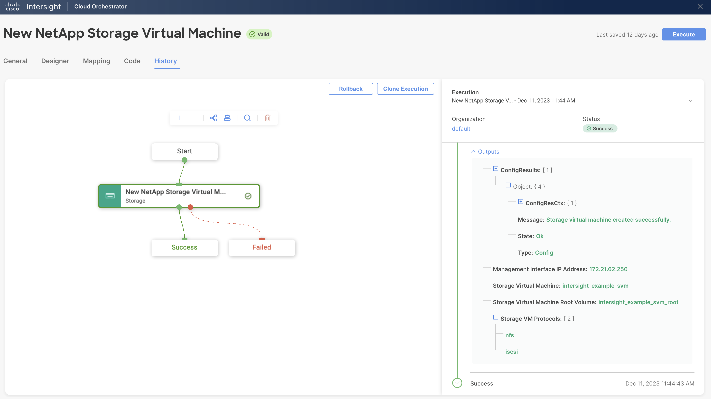

# New NetApp Storage Virtual Machine Workflow

## Workflow description and tasks

The New NetApp Storage Virtual Machine workflow creates a storage
virtual machine.

## Workflow inputs
\* indicates the input is required

- **Storage Device\***

- **Storage Virtual Machine Name\*:** Name for the new storage virtual.
machine

- **Storage VM Protocols\*:** Protocols to enable.

- **Manage Administrator Account: vsadmin:** Select this check box if you
want to manage the storage VM administrator account. If selected,
provide the password for the vsadmin account. To create a storage VM
management interface, select the 'Create Management Interface' check box
and provide an interface name, IP address, subnet mask, broadcast
domain, and home node name.

- **Route Destination IPv4 Gateway:** The IP address of the gateway router
leading to the destination.

## Example workflow execution

1.  Select the storage device.

2.  Provide the name for the storage virtual machine and select the
    protocols to enable. Note: If using CIFS, the CIFS protocol is not
    enabled until a CIFS server has been created for the storage virtual
    machine. Use the New NetApp CIFS Server task to create a CIFS
    server.

3.  Select the 'Manage Administrator Account' check box if you want to
    manage the storage VM administrator account. Provide a password for
    the vsadmin account. Select 'Create Management Interface' if you
    want to add a network interface for storage VM management. To create
    a management interface, you must provide an interface name, IP
    address, subnet mask, broadcast domain, and home node name.
    Optionally, provide the gateway router IP address.

4.  Review your input selections for correctness, then click **Execute**.

5.  View workflow execution details on the History tab.

