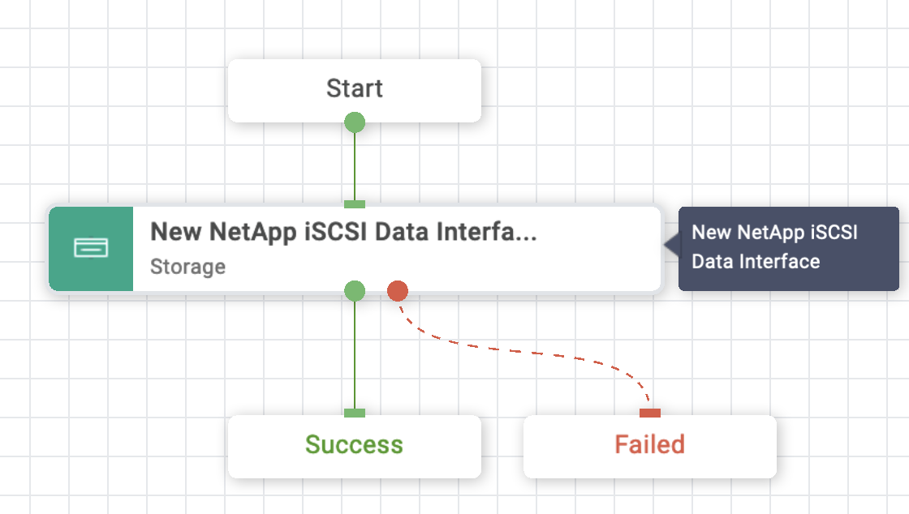
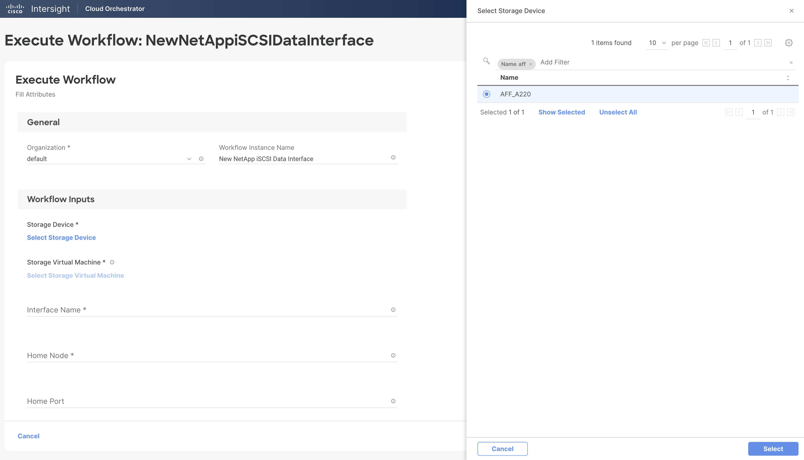
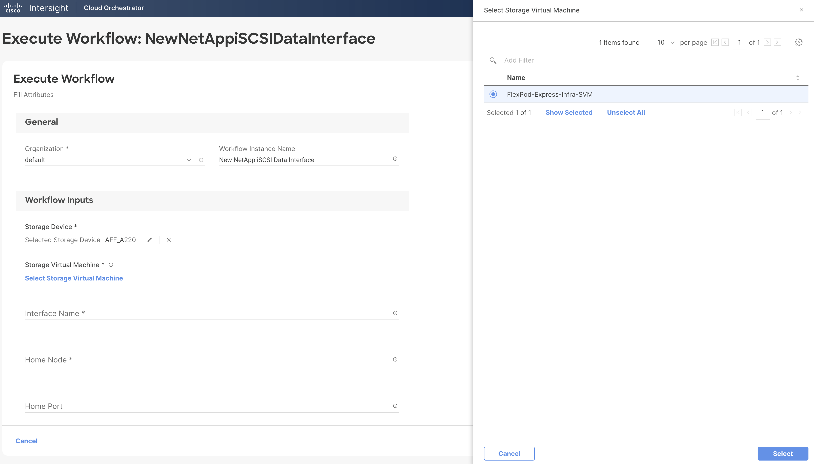
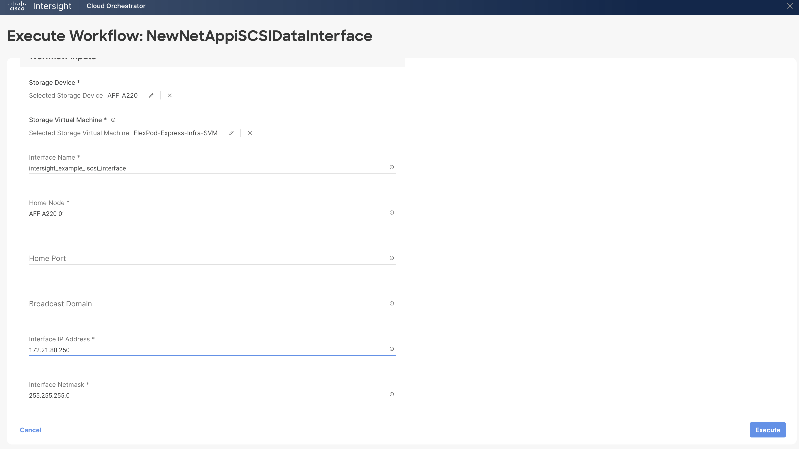
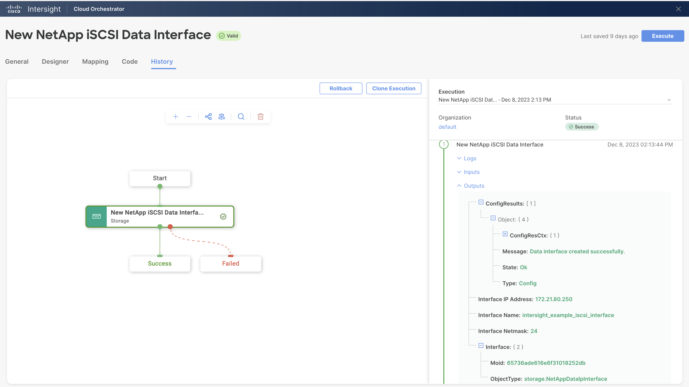

# New NetApp iSCSI Data Interface Workflow

## Workflow description and tasks

The New NetApp iSCSI Data Interface workflow creates an iSCSI data
interface.

## Workflow inputs
\* indicates the input is required

- **Storage Device\***

- **Storage Virtual Machine\***

- **Interface Name\*:** Name for the new iSCSI data interface.

- **Home Node\*:** Home node is the node to which the interface returns
when the network interface revert command is run.

- **Home Port:** Home port is the port to which the interface returns when
the network interface revert command is run.

- **Broadcast Domain:** Broadcast domain contains the home port of the
logical interface.

- **Interface IP Address\*:** IP address for the interface

- **Interface Netmask\*:** Netmask for the interface

## Example workflow execution

1.  Select the storage device and storage virtual machine.

2.  Provide the name of the interface and home node. The home port and
    broadcast domain are optional. Provide the IP address and netmask to
    use for the interface.

3.  Review your input selections for correctness, then click **Execute**.

4.  View workflow execution details on the History tab.

