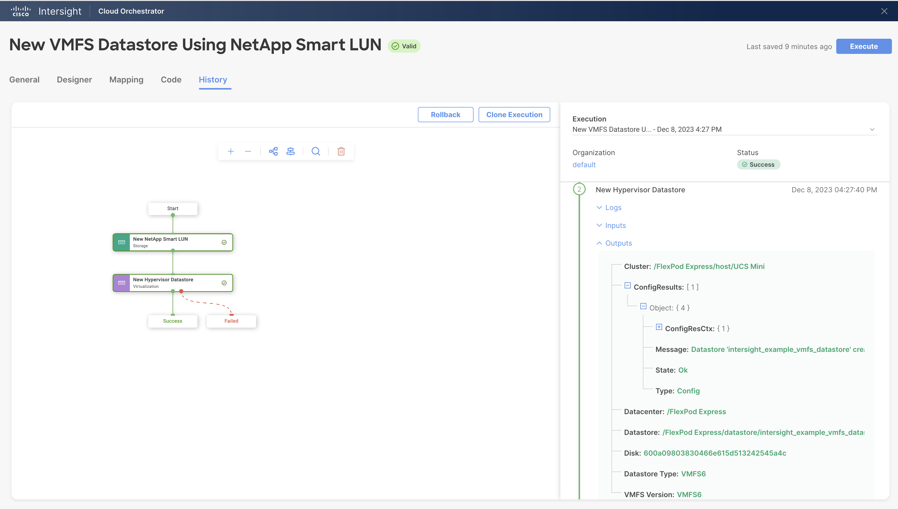

#  New VMFS Datastore Using NetApp Smart LUN Workflow

## Workflow description and tasks

The New VMFS Datastore Using NetApp Smart LUN workflow creates a new
VMFS datastore. A volume and LUN with the same name as the datastore are
created using the New NetApp Smart LUN task.

## Workflow inputs
\* indicates the input is required

### Hypervisor inputs:

**Hypervisor Manager\*:** Hypervisor manager managing the cluster in the
datacenter.

**Datacenter\*:** Datacenter associated with the cluster where the
datastore will be hosted.

**Cluster:** Cluster on which the datastore will be hosted.

**Host:** Host on which the datastore will be hosted. If the cluster is
specified, the host parameter will be ignored.

**Datastore Name\*:** Name of the datastore. The volume and LUN created
will be named the same as the datastore name and the LUN path will be at
/vol/datastore_name/datastore_name.

**Datastore Capacity\*:** Size of the datastore

**Datastore Type\*:** Type of the datastore (VMFS version 5 or 6)

### Storage inputs:

**Storage Device\***

**Storage Virtual Machine\***

**Performance Service Level\*:** Performance service levels represent
the performance expectations of the clients or applications using the
storage system. The selection of a performance service level indicates
the location of the new storage in the storage device and the QoS policy
assigned to the storage. Value is used for applications for which
throughput and capacity are more important than latency. Performance is
used for applications with modest performance needs and latency. Extreme
is used for applications that expect the lowest latency and highest
performance. **NOTE:** If the selected performance service level is not
valid for the storage platform, the task will fail with an error
message. Use the 'None' option if the storage virtual machine already
has a QoS policy group.

**Initiator Group\***: You can select an initiator group or create a new
one. If you create a new initiator group, you need to provide the
following inputs.

-   **Initiator Group Name\*:** The name of the initiator group.

-   **Operating System\*:** The host operating system of the initiator
    group. All initiators in the group should be hosts of the same
    operating system.

-   **Protocol:** The protocol(s) supported by the initiator group
    (iSCSI, FCP, or Mixed).

-   **Initiators\*:** The initiator(s) to add to the new initiator
    group. Use Fibre Channel (FC) world wide port names (WWPNs), iSCSI
    qualified names (IQNs), and/or iSCSI extended unique identifiers
    (EUIs) to identify host initiators.

**Enable Local Snapshot Copies:** Select this checkbox to enable local
snapshot copies using the default snapshot policy.

## Example workflow execution

1.  Select the hypervisor manager, datacenter, and cluster where the
    datastore will be created. Leave the host unselected to mount the
    new datastore on all the hosts. To mount the new datastore on a
    single host, select the host, but not the cluster.

2.  Provide the desired datastore name and capacity. Select the
    datastore type.

3.  Select storage device, storage virtual machine, and performance
    service level. **NOTE:** If the selected performance service level is
    not valid for the storage platform, the task will fail with an error
    message.

4.  Either select an existing initiator group or create a new initiator
    group. The example below selects an existing initiator group. To
    create a new initiator group instead, select 'New Initiator Group',
    then provide the initiator group name, operating system, protocol,
    and initiator(s).

5.  Enable local snapshot copies as needed.

6.  Review your input selections for correctness, then click **Execute**.

7.  View workflow execution details on the History tab.

