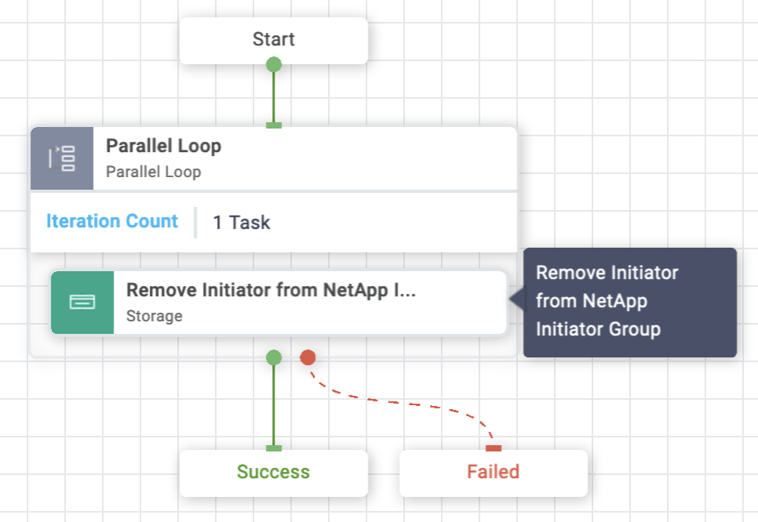
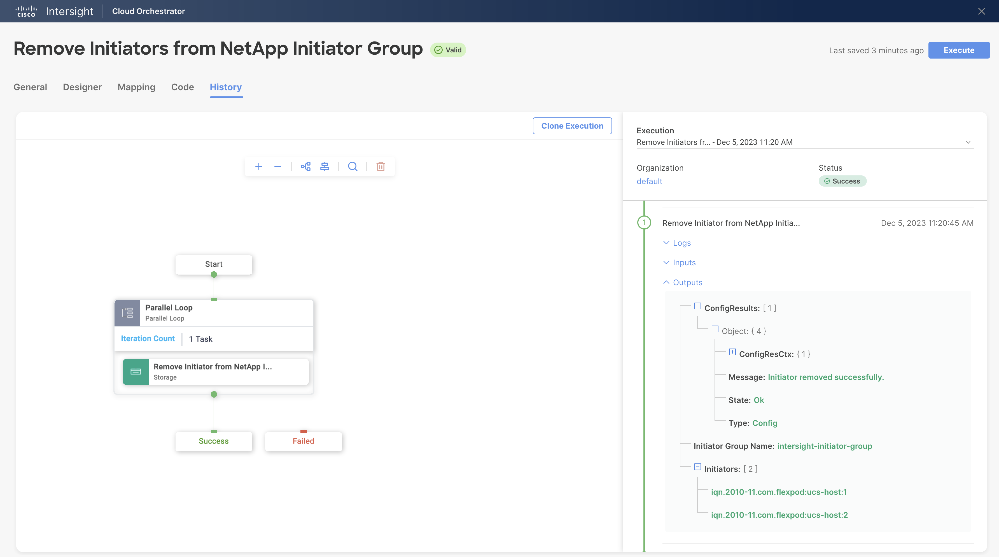

# Remove Initiators from NetApp Initiator Group Workflow

## Workflow description and tasks

The Remove Initiators from NetApp Initiator Group workflow removes one
or more initiators from an existing initiator group. The Remove
Initiator from NetApp Initiator Group task is run in parallel for each
initiator provided. The order of completion may differ from the order
that the initiators were given due to parallel execution.

## Workflow inputs
\* indicates the input is required

**Storage Device\***

**Storage Virtual Machine\***

**Initiator Group\***

**Initiators\*:** The initiators to add to the initiator group. Use
Fibre Channel (FC) world wide port names (WWPNs), iSCSI qualified names
(IQNs), and/or iSCSI extended unique identifiers (EUIs) to identify host
initiators.

## Example workflow execution

1.  Select the storage device, storage virtual machine, and initiator
    group.

2.  Provide the initiator(s) to remove from the initiator group.

3.  Review your input selections for correctness, then click **Execute**.

4.  View workflow execution details on the History tab.

**NOTE:** There is no Rollback available for this workflow. If you need to
undo this workflow execution, please use the Add Initiators to NetApp
Initiator Group workflow.
