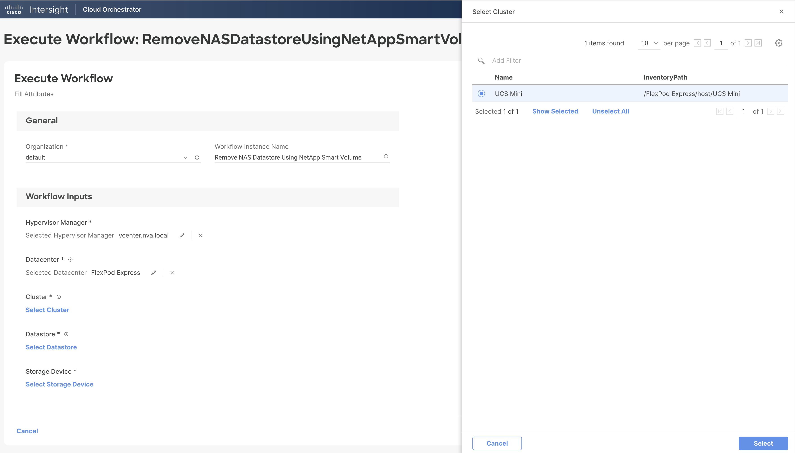

# Remove NAS Datastore Using NetApp Smart Volume Workflow

## Workflow description and tasks

The Remove NAS Datastore Using NetApp Smart Volume workflow removes a NAS datastore from all hosts in the cluster. The underlying storage volume is removed using the Remove NetApp NAS Smart Volume task.

## Workflow inputs
\* indicates the input is required

### Hypervisor inputs:

- **Hypervisor Manager\*:** Hypervisor manager managing the cluster in the
datacenter.

- **Datacenter\*:** Datacenter associated with the cluster where the
datastore is hosted.

- **Cluster\*:** Cluster on which the datastore is hosted.

- **Datastore\*:** Name of the datastore to be removed.

### Storage inputs:

- **Storage Device\***

## Example workflow execution

1.  Select the hypervisor manager, datacenter, cluster or host, and the
    datastore that is to be removed.

2.  Select the storage device.

3.  Review your input selections for correctness, then click **Execute**.

4.  View workflow execution details on the History tab.

