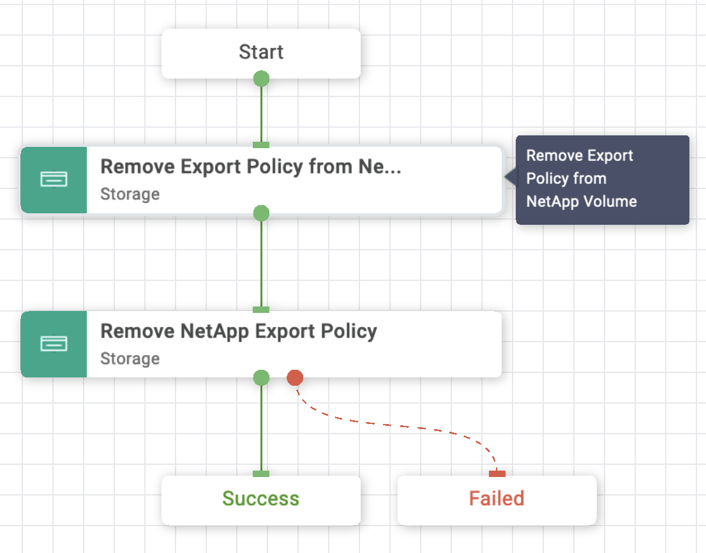

# Remove NetApp Export Policy Workflow

## Workflow description and tasks

The Remove NetApp Export Policy workflow removes an export policy from a
volume and deletes the export policy.

## Workflow inputs
The following are required inputs:

- **Storage Device\***

- **Storage Virtual Machine\***

- **Volume\***

- **Export Policy\***

## Example workflow execution

1.  Select the storage device, storage virtual machine, and volume.

2.  Select the export policy to
    remove.
    

3.  Review your input selections for correctness, then click **Execute**.

4.  View workflow execution details on the History tab.

