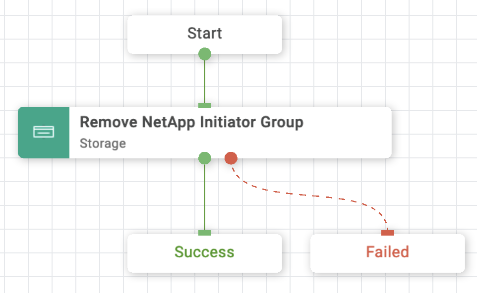

# Remove NetApp Initiator Group Workflow

## Workflow description and tasks

The Remove NetApp Initiator Group workflow removes an existing initiator
group.

## Workflow inputs
\* indicates the input is required

**Storage Device\***

**Storage Virtual Machine\***

**Initiator Group\***

## Example workflow execution

1.  Select the storage device, storage virtual machine, and initiator
    group.

2.  Review your input selections for correctness, then click **Execute**.

3.  View workflow execution details on the History tab.

