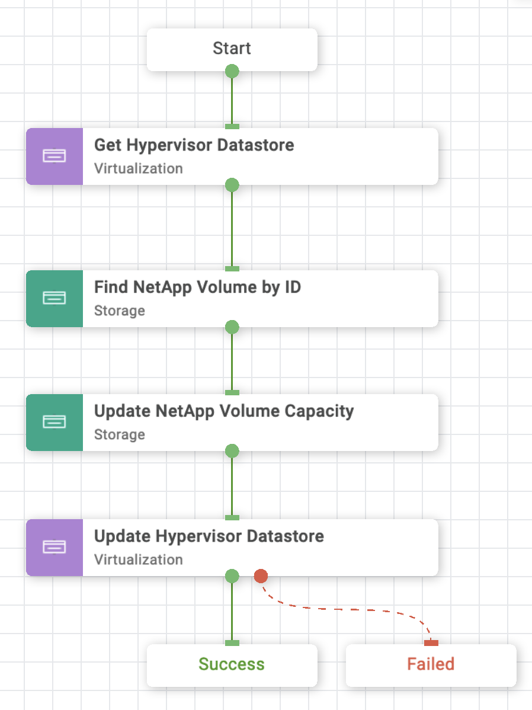

# Update NAS Datastore Using NetApp Smart Volume Workflow

## Workflow description and tasks

The Update NAS Datastore Using NetApp Smart Volume workflow updates a
NAS datastore by updating the capacity of the underlying NFS volume. The
updated capacity is visible to all hosts connected to the datastore.

## Workflow inputs
\* indicates the input is required

### Hypervisor inputs:

- **Hypervisor Manager\*:** Hypervisor manager managing the cluster in the
datacenter.

- **Datacenter\*:** Datacenter associated with the cluster where the
datastore is hosted.

- **Cluster:** Cluster on which the datastore is hosted.

- **Host:** Host on which the datastore is hosted. If the cluster is
specified, the host parameter will be ignored.

- **Datastore\*:** Name of the datastore for which capacity is to be
updated

- **Datastore Capacity\*:** New size of the datastore

### Storage inputs:

- **Storage Device\***

## Example workflow execution

1.  Select the hypervisor manager, datacenter, cluster or host, and
    datastore for which capacity is to be updated.

2.  Provide the updated datastore capacity.

3.  Select the storage device.

4.  Review your input selections for correctness, then click **Execute**.

5.  View workflow execution details on the History tab.

**NOTE:** Expand Hypervisor Datastore is the underlying task called Update
Hypervisor Datastore in this workflow. It can be used to expand or
shrink a datastore.