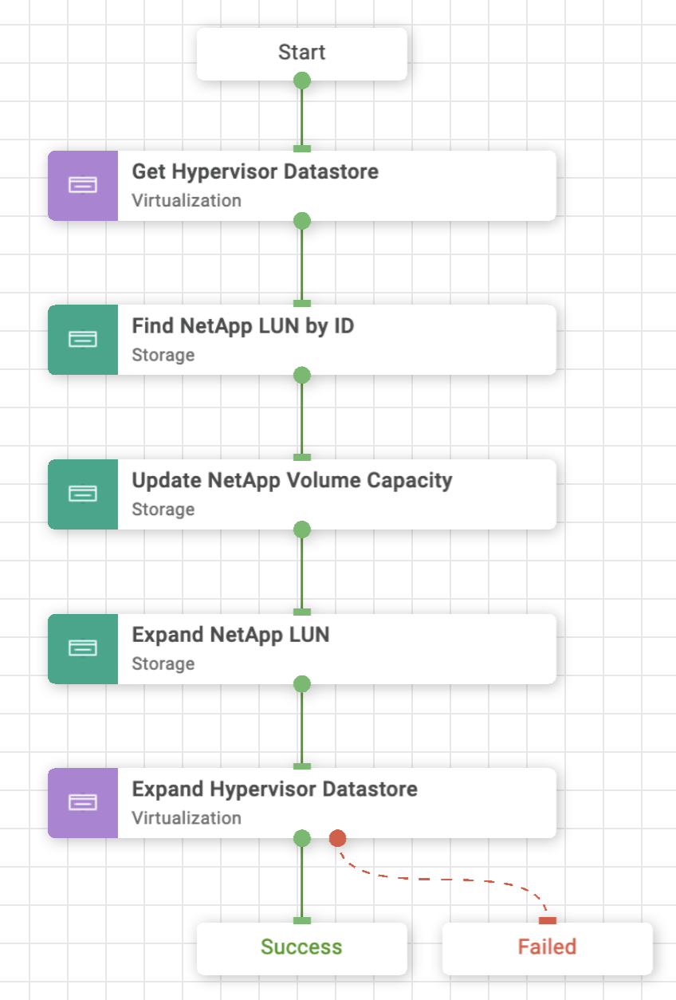

# Update VMFS Datastore Using NetApp Smart LUN Workflow

## Workflow description and tasks

The Update VMFS Datastore Using NetApp Smart LUN workflow expands the
capacity of the underlying storage volume/LUN, and then grows the
datastore to utilize the additional capacity.

## Workflow inputs
\* indicates the input is required

### Hypervisor inputs:

- **Hypervisor Manager\*:** Hypervisor manager managing the cluster in the
datacenter.

- **Datacenter\*:** Datacenter associated with the cluster where the
datastore is hosted.

- **Cluster:** Cluster on which the datastore will be hosted.

- **Host:** Host on which the datastore will be hosted. If the cluster is
specified, the host parameter will be ignored.

- **Datastore\*:** Name of the datastore for which capacity is to be
expanded

- **Datastore Capacity\*:** New size of the datastore

### Storage inputs:

- **Storage Device\***

## Example workflow execution

1.  Select the hypervisor manager, datacenter, cluster or host, and
    datastore for which capacity is to be expanded.

2.  Provide the updated datastore capacity.

3.  Select the storage device.

4.  Review your input selections for correctness, then click **Execute**.

5.  View workflow execution details on the History tab.

