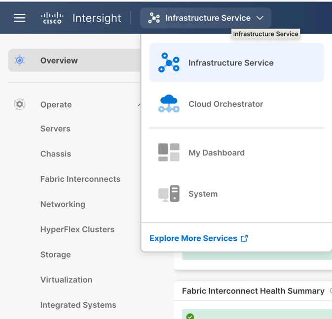
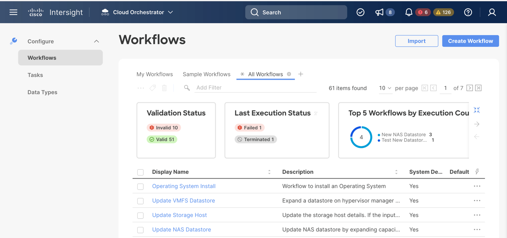
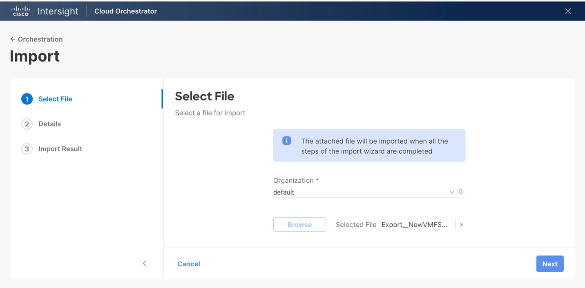
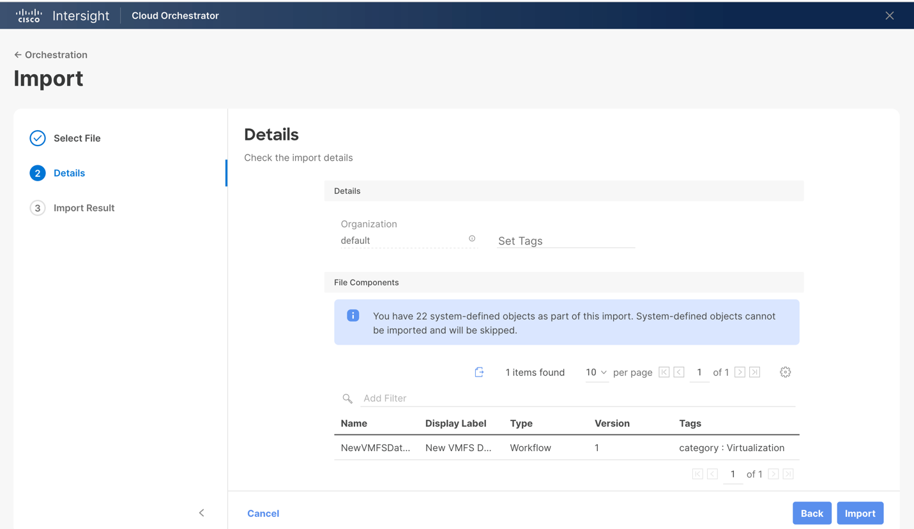
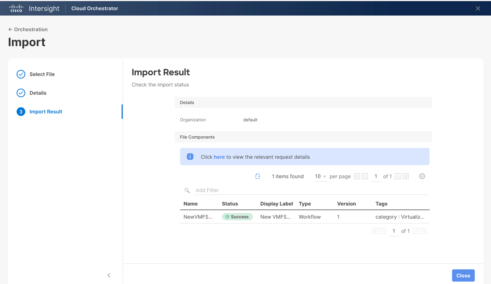
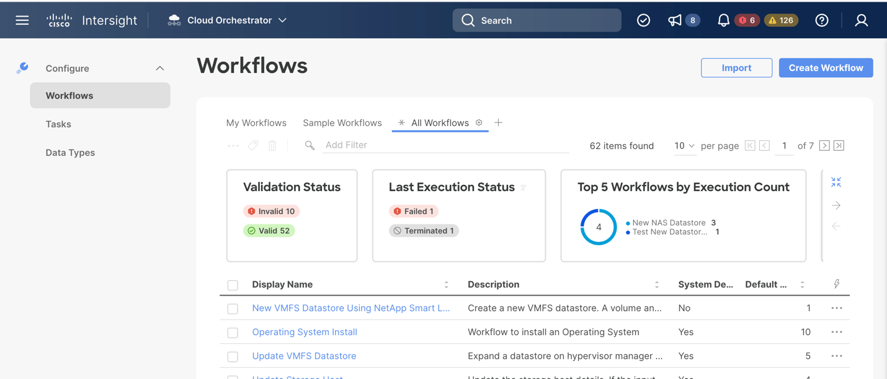

# Import Workflow into Cisco Intersight Cloud Orchestrator

1.  Log in to Cisco Intersight.

2.  Select **Cloud Orchestrator** service from the service dropdown menu.

3.  Click the **Import** button near the upper right-hand corner of the
    Workflows page to start the workflow import process.

4.  Use the **Browse** button to select the workflow JSON file you
    downloaded from the GitHub repository and click Next.

5.  Check and review the import details, then click **Import**.

6.  Review import result, then click **Close**.

7.  Check under the All Workflows tab for the newly imported workflow.

